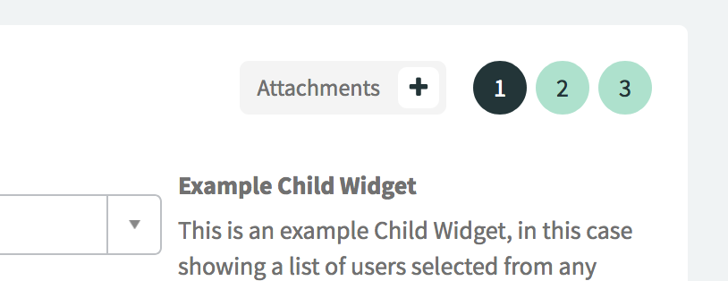
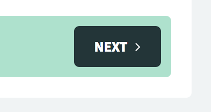
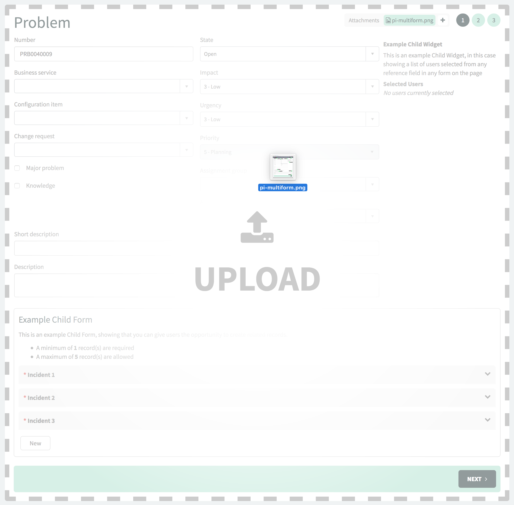

 Multiform
==================
Multiform is an advanced Service Portal form widget that separates each section of the form onto sequential, numbered screens for improved user experience. It also offers a number of other benefits over the out-of-box form widget, such as:

- **Screen-based form completion**

	Each form section becomes its own screen. Screens are able to be navigated through the buttons at the bottom of the form, and the indicators on the top-right.
	
	
	
	

- **Drag & drop file upload**

	Both drag and drop and regular upload (via the  button) are supported.
	
	

- **Support for all native form functionality**
	
	All native form functionality is supported, such as
	
	- Client Scripts
	- UI Policy
	- Read-only fields
	- Mandatory fields
	- Form layouts
	- Reference fields
	- Dictionary attributes

- **Embedded “Child Forms” (related lists)**

	Child forms can be embedded on the top, left, right, or bottom of a screen, or on all screens. Minimum and maximum number of related records can optionally be set.

- **Embedded “Child Widgets”**

	Child widgets can be embedded in the same places as child forms. An easy to use API can be called in your widgets to access fields on all forms and execute functions when the form changes.

- **Easy to style**
	
	Simply declare a few SASS variables in your theme/page/portal to override certain styles, such as indicator colour, bottom bar colour, and rounded corners.
	
Screenshots
-------------------

	
	
Installaton
-------------------
1. Open Studio on your ServiceNow instance.
2. Click the **Import From Source Control** button.
3. As the value of the URL field use the following:
	`https://github.com/platform-experience/pi-multiform`
4. Press the **Import** button

Usage
-------------------
The application includes a test page, which can be accessed from the `/sp?id=x_mf_test` path on your instance. This will give you an example of some of the features and how to configure them.